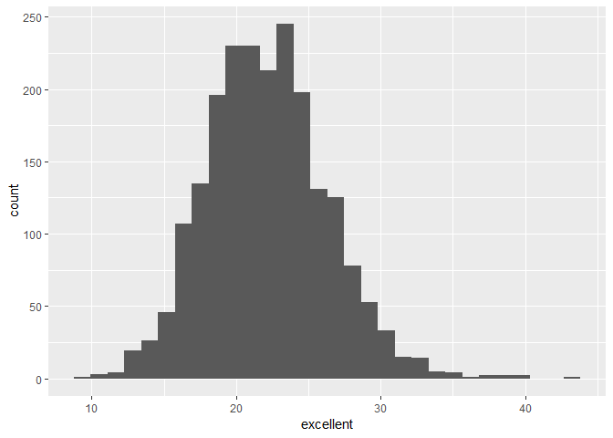
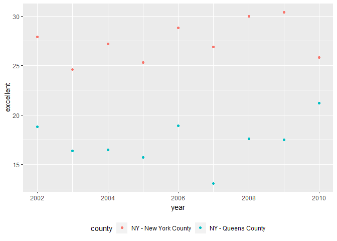

p8105\_hw2\_yg2625
================
Yue Gu
October 2, 2018

Library
=======

``` r
library(tidyverse)
library(readxl)
```

Problem 1
=========

Data reading and cleaning
-------------------------

Read and clean the data and convert the entry variable from character to logical

``` r
NYCsub_data = 
  read_csv("./data/NYC_Transit_Subway_Entrance_And_Exit_Data.csv") %>% 
  janitor::clean_names(dat = .) %>% 
  select(.data = ., line, station_name, station_latitude, station_longitude, route1:route11, entry, vending, entrance_type, ada) %>% 
  mutate(.data = ., entry = ifelse(entry == "YES", TRUE, FALSE))
```

    ## Parsed with column specification:
    ## cols(
    ##   .default = col_character(),
    ##   `Station Latitude` = col_double(),
    ##   `Station Longitude` = col_double(),
    ##   Route8 = col_integer(),
    ##   Route9 = col_integer(),
    ##   Route10 = col_integer(),
    ##   Route11 = col_integer(),
    ##   ADA = col_logical(),
    ##   `Free Crossover` = col_logical(),
    ##   `Entrance Latitude` = col_double(),
    ##   `Entrance Longitude` = col_double()
    ## )

    ## See spec(...) for full column specifications.

``` r
NYCsub_data 
```

    ## # A tibble: 1,868 x 19
    ##    line  station_name station_latitude station_longitu~ route1 route2
    ##    <chr> <chr>                   <dbl>            <dbl> <chr>  <chr> 
    ##  1 4 Av~ 25th St                  40.7            -74.0 R      <NA>  
    ##  2 4 Av~ 25th St                  40.7            -74.0 R      <NA>  
    ##  3 4 Av~ 36th St                  40.7            -74.0 N      R     
    ##  4 4 Av~ 36th St                  40.7            -74.0 N      R     
    ##  5 4 Av~ 36th St                  40.7            -74.0 N      R     
    ##  6 4 Av~ 45th St                  40.6            -74.0 R      <NA>  
    ##  7 4 Av~ 45th St                  40.6            -74.0 R      <NA>  
    ##  8 4 Av~ 45th St                  40.6            -74.0 R      <NA>  
    ##  9 4 Av~ 45th St                  40.6            -74.0 R      <NA>  
    ## 10 4 Av~ 53rd St                  40.6            -74.0 R      <NA>  
    ## # ... with 1,858 more rows, and 13 more variables: route3 <chr>,
    ## #   route4 <chr>, route5 <chr>, route6 <chr>, route7 <chr>, route8 <int>,
    ## #   route9 <int>, route10 <int>, route11 <int>, entry <lgl>,
    ## #   vending <chr>, entrance_type <chr>, ada <lgl>

Resulting data description
--------------------------

From the data output, we could know it contains variables including line, station\_name, station\_latitude, station\_longitude, route1, route2, route3, route4, route5, route6, route7, route8, route9, route10, route11, entry, vending, entrance\_type, ada; And I clean the names to lower case and only keep the variables as required while converting the entry variable from character to logical; The dimension of the dataset is 1868, 19, the current data is not tidy.

Answering question with data
----------------------------

There are 465 distinct stations. And there are 84 stations are ADA compliant. And the proportion of station entrances/exits without vending allow entrance is 0.3770492

Reformat data
-------------

``` r
NYCsub_tidy_data = gather(NYCsub_data, key = route, value = route_name, route1:route11)
NYCsub_tidy_data
```

    ## # A tibble: 20,548 x 10
    ##    line  station_name station_latitude station_longitu~ entry vending
    ##    <chr> <chr>                   <dbl>            <dbl> <lgl> <chr>  
    ##  1 4 Av~ 25th St                  40.7            -74.0 TRUE  YES    
    ##  2 4 Av~ 25th St                  40.7            -74.0 TRUE  YES    
    ##  3 4 Av~ 36th St                  40.7            -74.0 TRUE  YES    
    ##  4 4 Av~ 36th St                  40.7            -74.0 TRUE  YES    
    ##  5 4 Av~ 36th St                  40.7            -74.0 TRUE  YES    
    ##  6 4 Av~ 45th St                  40.6            -74.0 TRUE  YES    
    ##  7 4 Av~ 45th St                  40.6            -74.0 TRUE  YES    
    ##  8 4 Av~ 45th St                  40.6            -74.0 TRUE  YES    
    ##  9 4 Av~ 45th St                  40.6            -74.0 TRUE  YES    
    ## 10 4 Av~ 53rd St                  40.6            -74.0 TRUE  YES    
    ## # ... with 20,538 more rows, and 4 more variables: entrance_type <chr>,
    ## #   ada <lgl>, route <chr>, route_name <chr>

There are 60 stations serve the A train. And in these stations, 17 are ADA compliant.

Problem 2
=========

Mr. Trash Dataset
-----------------

Read and clean the data from Mr. Trash, specifying sheet. Renaming variable names, omitting rows and rounding numbers as required.

``` r
Healthy_data = 
  read_excel("data/HealthyHarborWaterWheelTotals2018-7-28.xlsx", sheet = "Mr. Trash Wheel", range = cell_cols("A:N")) %>%
  janitor::clean_names(dat = .) %>% 
  filter(.data = ., dumpster != "") %>% 
  rename(.data = ., weight = weight_tons, volume = volume_cubic_yards) %>% 
  mutate(.data = ., sports_balls = as.integer(round(sports_balls)))

Healthy_data
```

    ## # A tibble: 285 x 14
    ##    dumpster month  year date                weight volume plastic_bottles
    ##       <dbl> <chr> <dbl> <dttm>               <dbl>  <dbl>           <dbl>
    ##  1        1 May    2014 2014-05-16 00:00:00   4.31     18            1450
    ##  2        2 May    2014 2014-05-16 00:00:00   2.74     13            1120
    ##  3        3 May    2014 2014-05-16 00:00:00   3.45     15            2450
    ##  4        4 May    2014 2014-05-17 00:00:00   3.1      15            2380
    ##  5        5 May    2014 2014-05-17 00:00:00   4.06     18             980
    ##  6        6 May    2014 2014-05-20 00:00:00   2.71     13            1430
    ##  7        7 May    2014 2014-05-21 00:00:00   1.91      8             910
    ##  8        8 May    2014 2014-05-28 00:00:00   3.7      16            3580
    ##  9        9 June   2014 2014-06-05 00:00:00   2.52     14            2400
    ## 10       10 June   2014 2014-06-11 00:00:00   3.76     18            1340
    ## # ... with 275 more rows, and 7 more variables: polystyrene <dbl>,
    ## #   cigarette_butts <dbl>, glass_bottles <dbl>, grocery_bags <dbl>,
    ## #   chip_bags <dbl>, sports_balls <int>, homes_powered <dbl>

Precipitation Dataset
---------------------

Read and clean precipitation data for 2016 and 2017. Omitting rows, adding variable year, combining datasets and converting month to character as required.

``` r
Prec_2016 =
  read_excel("data/HealthyHarborWaterWheelTotals2018-7-28.xlsx", sheet = "2016 Precipitation", range = cell_rows(2:14)) %>% 
  janitor::clean_names(dat = .) %>% 
  filter(.data = ., total != "") %>% 
  mutate(.data = ., year = "2016")
Prec_2016
```

    ## # A tibble: 12 x 3
    ##    month total year 
    ##    <dbl> <dbl> <chr>
    ##  1     1  3.23 2016 
    ##  2     2  5.32 2016 
    ##  3     3  2.24 2016 
    ##  4     4  1.78 2016 
    ##  5     5  5.19 2016 
    ##  6     6  3.2  2016 
    ##  7     7  6.09 2016 
    ##  8     8  3.96 2016 
    ##  9     9  4.53 2016 
    ## 10    10  0.62 2016 
    ## 11    11  1.47 2016 
    ## 12    12  2.32 2016

``` r
Prec_2017 =
  read_excel("data/HealthyHarborWaterWheelTotals2018-7-28.xlsx", sheet = "2017 Precipitation", range = cell_rows(2:14)) %>% 
  janitor::clean_names(dat = .) %>% 
  filter(.data = ., total != "") %>% 
  mutate(.data = ., year = "2017")
Prec_2017
```

    ## # A tibble: 12 x 3
    ##    month total year 
    ##    <dbl> <dbl> <chr>
    ##  1     1  2.34 2017 
    ##  2     2  1.46 2017 
    ##  3     3  3.57 2017 
    ##  4     4  3.99 2017 
    ##  5     5  5.64 2017 
    ##  6     6  1.4  2017 
    ##  7     7  7.09 2017 
    ##  8     8  4.44 2017 
    ##  9     9  1.95 2017 
    ## 10    10  0    2017 
    ## 11    11  0.11 2017 
    ## 12    12  0.94 2017

``` r
Prec_data = 
  bind_rows(Prec_2016, Prec_2017) %>%
  mutate(month = month.name[month])
Prec_data
```

    ## # A tibble: 24 x 3
    ##    month     total year 
    ##    <chr>     <dbl> <chr>
    ##  1 January    3.23 2016 
    ##  2 February   5.32 2016 
    ##  3 March      2.24 2016 
    ##  4 April      1.78 2016 
    ##  5 May        5.19 2016 
    ##  6 June       3.2  2016 
    ##  7 July       6.09 2016 
    ##  8 August     3.96 2016 
    ##  9 September  4.53 2016 
    ## 10 October    0.62 2016 
    ## # ... with 14 more rows

The number of the observations in Mr. Trash is 285, in Precipitation for 2016 is 12, in Precipitation for 2017 is 12, in combined dataset for 2016-2007 precipitation is 24. The total precipitation in 2017 is 32.93 and the median of sports balls in a dumpster in 2016 is 26.

Problem 3
---------

Data reading and cleaning
-------------------------

Read and clean BRFSS data. Formating, filtering, excluding variables, structuring data and creating new variables as required.

``` r
library(p8105.datasets)
data(brfss_smart2010)
brfss_smart2010_tidy = 
  brfss_smart2010 %>% 
  janitor::clean_names() %>% 
  filter(.data = ., topic == "Overall Health") %>% 
  select(.data = ., -class, -topic, -question, -sample_size, -confidence_limit_low: -geo_location) %>% 
  spread(key = response, value = data_value) %>% 
  janitor::clean_names() %>% 
  mutate(.data = ., excellent_or_very_good = excellent + very_good) %>% 
  rename(.data = ., state = locationabbr, county = locationdesc)

brfss_smart2010_tidy
```

    ## # A tibble: 2,125 x 9
    ##     year state county excellent  fair  good  poor very_good
    ##    <int> <chr> <chr>      <dbl> <dbl> <dbl> <dbl>     <dbl>
    ##  1  2002 AK    AK - ~      27.9   8.6  23.8   5.9      33.7
    ##  2  2002 AL    AL - ~      18.5  12.1  32.7   5.9      30.9
    ##  3  2002 AR    AR - ~      24.1  12.5  29.9   4.2      29.3
    ##  4  2002 AZ    AZ - ~      21.6  10.3  26.9   4.6      36.6
    ##  5  2002 AZ    AZ - ~      26.6   7.5  31.9   3.9      30.1
    ##  6  2002 CA    CA - ~      22.7  14.3  28.7   4.5      29.8
    ##  7  2002 CO    CO - ~      21.2  14.4  29     4.2      31.2
    ##  8  2002 CO    CO - ~      25.5   8    29.3   2.1      35.2
    ##  9  2002 CO    CO - ~      22.2  11.1  36.6   3        27.1
    ## 10  2002 CO    CO - ~      23.4  11.4  26.3   2.4      36.6
    ## # ... with 2,115 more rows, and 1 more variable:
    ## #   excellent_or_very_good <dbl>

Answering questions
-------------------

There are 404 distinct county and 51 distinct states.Since there are 51 states, all states are included. And yes, every state is represented.

``` r
arrange(count(brfss_smart2010_tidy, state), desc(n))
```

    ## # A tibble: 51 x 2
    ##    state     n
    ##    <chr> <int>
    ##  1 NJ      146
    ##  2 FL      122
    ##  3 NC      115
    ##  4 WA       97
    ##  5 MD       90
    ##  6 MA       79
    ##  7 TX       71
    ##  8 NY       65
    ##  9 SC       63
    ## 10 CO       59
    ## # ... with 41 more rows

From the output above, we know NJ state is observed the most with 146 times. And the median of the "Excellent" response value is 23.6.

Histogram of "excellent" response in 2002
-----------------------------------------

``` r
ggplot(subset(brfss_smart2010_tidy, year == 2002), aes(x = excellent)) +
  geom_histogram()
```

    ## `stat_bin()` using `bins = 30`. Pick better value with `binwidth`.

    ## Warning: Removed 2 rows containing non-finite values (stat_bin).



Scatterplot
-----------

Showing proportion of "Excellent" in NY and Queens County in each year from 2002 to 2010

``` r
brfss_smart2010_tidy_NQ = 
  brfss_smart2010_tidy %>% 
  filter(.data = ., county == "NY - Queens County" | county == "NY - New York County") %>% 
  select(.data = ., -fair:-excellent_or_very_good)

ggplot(brfss_smart2010_tidy_NQ, aes(x = year, y = excellent)) +
  geom_point(aes(color = county)) +
  theme(legend.position = "bottom")
```


