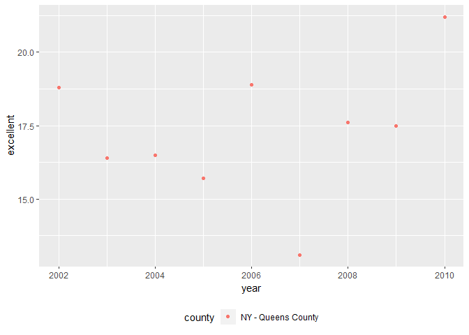

p8105\_hw2\_yg2625
================
Yue Gu
October 2, 2018

Library
=======

``` r
library(tidyverse)
library(readxl)
```

Problem 1
=========

Data cleaning
-------------

Read and clean the data and convert the entry variable from character to logical

``` r
NYCsub_data = 
  read_csv("./data/NYC_Transit_Subway_Entrance_And_Exit_Data.csv") %>% 
  janitor::clean_names(dat = .) %>% 
  select(.data = ., line, station_name, station_latitude, station_longitude, route1:route11, entry, vending, entrance_type, ada) %>% 
  mutate(.data = ., entry = ifelse(entry == "YES", TRUE, FALSE))
```

    ## Parsed with column specification:
    ## cols(
    ##   .default = col_character(),
    ##   `Station Latitude` = col_double(),
    ##   `Station Longitude` = col_double(),
    ##   Route8 = col_integer(),
    ##   Route9 = col_integer(),
    ##   Route10 = col_integer(),
    ##   Route11 = col_integer(),
    ##   ADA = col_logical(),
    ##   `Free Crossover` = col_logical(),
    ##   `Entrance Latitude` = col_double(),
    ##   `Entrance Longitude` = col_double()
    ## )

    ## See spec(...) for full column specifications.

``` r
NYCsub_data 
```

    ## # A tibble: 1,868 x 19
    ##    line  station_name station_latitude station_longitu~ route1 route2
    ##    <chr> <chr>                   <dbl>            <dbl> <chr>  <chr> 
    ##  1 4 Av~ 25th St                  40.7            -74.0 R      <NA>  
    ##  2 4 Av~ 25th St                  40.7            -74.0 R      <NA>  
    ##  3 4 Av~ 36th St                  40.7            -74.0 N      R     
    ##  4 4 Av~ 36th St                  40.7            -74.0 N      R     
    ##  5 4 Av~ 36th St                  40.7            -74.0 N      R     
    ##  6 4 Av~ 45th St                  40.6            -74.0 R      <NA>  
    ##  7 4 Av~ 45th St                  40.6            -74.0 R      <NA>  
    ##  8 4 Av~ 45th St                  40.6            -74.0 R      <NA>  
    ##  9 4 Av~ 45th St                  40.6            -74.0 R      <NA>  
    ## 10 4 Av~ 53rd St                  40.6            -74.0 R      <NA>  
    ## # ... with 1,858 more rows, and 13 more variables: route3 <chr>,
    ## #   route4 <chr>, route5 <chr>, route6 <chr>, route7 <chr>, route8 <int>,
    ## #   route9 <int>, route10 <int>, route11 <int>, entry <lgl>,
    ## #   vending <chr>, entrance_type <chr>, ada <lgl>

Resulting data description
--------------------------

From the data output, we could know it contains variables including line, station\_name, station\_latitude, station\_longitude, route1, route2, route3, route4, route5, route6, route7, route8, route9, route10, route11, entry, vending, entrance\_type, ada; And I clean the names to lower case and only keep the variables as required while converting the entry variable from character to logical; The dimension of the dataset is 1868, 19, the current data is not tidy.

Answering question with data
----------------------------

There are 356 distinct stations. And there are 468 stations are ADA compliant. And the proportion of station entrances/exits without vending allow entrance is 0.0369379

Reformat data
-------------

``` r
NYCsub_tidy_data = gather(NYCsub_data, key = route, value = route_name, route1:route11)
```

There are 3 stations serve the A train. And in these stations, 107 are ADA compliant.

Problem 2
=========

Read and clean the data from Mr. Trash

``` r
Healthy_data = 
  read_excel("data/HealthyHarborWaterWheelTotals2018-7-28.xlsx", sheet = "Mr. Trash Wheel", range = cell_cols("A:N")) %>%
  janitor::clean_names(dat = .) %>% 
  filter(.data = ., dumpster != "") %>% 
  mutate(.data = ., sports_balls = as.integer(round(sports_balls)))
```

Read and clean precipitation data

``` r
Prec_2016 =
  read_excel("data/HealthyHarborWaterWheelTotals2018-7-28.xlsx", sheet = "2016 Precipitation", range = cell_rows(2:15)) %>% 
  janitor::clean_names(dat = .) %>% 
  filter(.data = ., total != "") %>% 
  mutate(.data = ., year = "2016")

Prec_2017 =
  read_excel("data/HealthyHarborWaterWheelTotals2018-7-28.xlsx", sheet = "2017 Precipitation", range = cell_rows(2:15)) %>% 
  janitor::clean_names(dat = .) %>% 
  filter(.data = ., total != "") %>% 
  mutate(.data = ., year = "2017")

Prec_data = 
  left_join(Prec_2016, Prec_2017, by = "month") %>%
  filter(.data = ., month != "") %>% 
  mutate(.data = ., month = month.name)
```

Comment with incline code

``` r
count(Healthy_data)
```

    ## # A tibble: 1 x 1
    ##       n
    ##   <int>
    ## 1   285

``` r
count(Prec_2016)
```

    ## # A tibble: 1 x 1
    ##       n
    ##   <int>
    ## 1    13

``` r
count(Prec_2017)
```

    ## # A tibble: 1 x 1
    ##       n
    ##   <int>
    ## 1    13

``` r
count(Prec_data)
```

    ## # A tibble: 1 x 1
    ##       n
    ##   <int>
    ## 1    12

``` r
median(Healthy_data$sports_balls)
```

    ## [1] 8

``` r
max(Prec_2017$total)
```

    ## [1] 32.93

Problem 3
---------

Read and clean BRFSS data

``` r
library(p8105.datasets)
data(brfss_smart2010)
brfss_smart2010_tidy = 
  brfss_smart2010 %>% 
  janitor::clean_names() %>% 
  filter(.data = ., topic == "Overall Health") %>% 
  select(.data = ., -class, -topic, -question, -sample_size, -confidence_limit_low: -geo_location) %>% 
  spread(key = response, value = data_value) %>% 
  janitor::clean_names() %>% 
  mutate(.data = ., excellent_or_very_good = excellent + very_good) %>% 
  rename(.data = ., state = locationabbr, county = locationdesc)
```

Since there's 51 distinct states, all states are included

``` r
count(distinct(brfss_smart2010_tidy, county))
```

    ## # A tibble: 1 x 1
    ##       n
    ##   <int>
    ## 1   404

``` r
count(distinct(brfss_smart2010_tidy, state))
```

    ## # A tibble: 1 x 1
    ##       n
    ##   <int>
    ## 1    51

``` r
head(arrange(count(brfss_smart2010_tidy, state), desc(n)), 1)
```

    ## # A tibble: 1 x 2
    ##   state     n
    ##   <chr> <int>
    ## 1 NJ      146

Median of "excellent"

``` r
summary(subset(brfss_smart2010_tidy, year == "2002")$excellent)
```

    ##    Min. 1st Qu.  Median    Mean 3rd Qu.    Max.    NA's 
    ##   14.60   20.35   23.60   23.96   26.90   43.20       2

Histogram of "excellent"

``` r
ggplot(brfss_smart2010_tidy, aes(x = excellent)) +
  geom_histogram()
```

    ## `stat_bin()` using `bins = 30`. Pick better value with `binwidth`.

    ## Warning: Removed 6 rows containing non-finite values (stat_bin).



Scatterplot showing proportion

``` r
brfss_smart2010_tidy_NQ = 
  brfss_smart2010_tidy %>% 
  filter(.data = ., county == "NY - Queens County" | state == "NY - New York County") %>% 
  select(.data = ., -fair:-excellent_or_very_good)

ggplot(brfss_smart2010_tidy_NQ, aes(x = year, y = excellent)) +
  geom_point(aes(color = county)) +
  theme(legend.position = "bottom")
```


